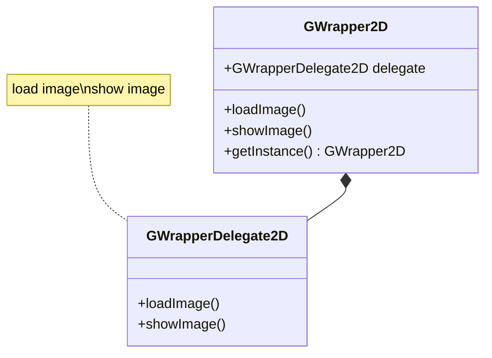

# GWrapper

## How it should works

```mermaid
classDiagram
    GWrapper2D *-- GWrapperDelegate2D
    note for GWrapperDelegate2D "load image\nshow image"
    class GWrapper2D{
        +GWrapperDelegate2D delegate
        +loadImage()
        +showImage()
        +getInstance()GWrapper2D 
    }
    class GWrapperDelegate2D{
        +loadImage()
        +showImage()
    }
```